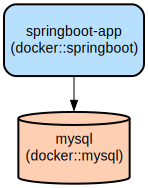

# Spring Boot Student Management Service with Docker Integration

A containerized Spring Boot application that provides RESTful endpoints for managing student records with MySQL persistence. The service demonstrates Docker containerization best practices and includes automated build and deployment configurations.

This project showcases a modern microservice architecture using Spring Boot with Docker integration. It implements a student management system with basic CRUD operations, utilizing MySQL for data persistence and Docker for containerization. The application follows best practices for containerization, including multi-stage builds, environment configuration, and Docker Compose for orchestration.

## Repository Structure
```
.
├── docker-compose.yml          # Docker Compose configuration for service orchestration
├── Dockerfile                  # Docker image build instructions
├── mvnw                       # Maven wrapper script for Unix systems
├── mvnw.cmd                   # Maven wrapper script for Windows
├── pom.xml                    # Maven project configuration and dependencies
└── src/
    ├── main/
    │   ├── java/             # Java source files
    │   │   └── com/example/docker/Docker/exampler/
    │   │       ├── controller/   # REST API endpoints
    │   │       ├── dto/          # Data Transfer Objects
    │   │       ├── entity/       # JPA entities
    │   │       ├── repository/   # Data access layer
    │   │       └── service/      # Business logic layer
    │   └── resources/
    │       └── application.properties  # Application configuration
    └── test/                  # Test source files
```

## Usage Instructions
### Prerequisites
- Java Development Kit (JDK) 17 or later
- Docker Engine 20.10.x or later
- Docker Compose v2.x
- Maven 3.9.x (optional, wrapper included)

### Installation

1. Clone the repository:
```bash
git clone <repository-url>
cd <repository-directory>
```

2. Build the application:
```bash
# Using Maven wrapper
./mvnw clean package

# Or using installed Maven
mvn clean package
```

3. Build and start the containers:
```bash
docker-compose up -d
```

### Quick Start
1. Verify the application is running:
```bash
curl http://localhost:8081/students
```

2. Add a new student:
```bash
curl -X POST http://localhost:8081/student \
  -H "Content-Type: application/json" \
  -d '{"name":"John Doe","email":"john.doe@example.com"}'
```

### More Detailed Examples

1. Get all students:
```bash
curl -X GET http://localhost:8081/students
```

Response:
```json
[
  {
    "name": "John Doe",
    "email": "john.doe@example.com"
  }
]
```

### Troubleshooting

1. Database Connection Issues
- Problem: Application fails to connect to MySQL
- Error: `Communications link failure`
- Solution: 
  ```bash
  # Check if MySQL container is running
  docker ps | grep mysql-container
  
  # Check MySQL logs
  docker logs mysql-container
  ```

2. Application Startup Issues
- Problem: Spring Boot application fails to start
- Solution:
  ```bash
  # Check application logs
  docker logs springboot-app
  
  # Verify environment variables
  docker-compose config
  ```

## Data Flow
The application follows a traditional layered architecture for processing student data.

```ascii
Client Request → Controller → Service → Repository → MySQL Database
     ↑                                                    ↓
     └────────────────── JSON Response ─────────────────←┘
```

Component interactions:
1. Controller (`StudentController`) receives HTTP requests
2. Service layer (`StudentService`) implements business logic
3. Repository (`StudentRepository`) handles data persistence
4. DTO (`Student`) and Entity (`StudentEntity`) manage data transformation
5. MySQL database stores the student records

## Infrastructure



### Docker Resources
1. MySQL Database (mysql:8.0)
   - Container name: mysql-container
   - Port: 3306
   - Persistent volume: mysql-data

2. Spring Boot Application
   - Container name: springboot-app
   - Port: 8081:8080
   - Base image: openjdk:17-jdk-alpine
   - Dependencies: mysql service

### Environment Configuration
- Database URL: jdbc:mysql://mysql:3306/test
- Database credentials: 
  - Username: root
  - Password: root
- JPA Configuration:
  - Hibernate ddl-auto: update
  - Show SQL: true
  - Dialect: MySQL8Dialect